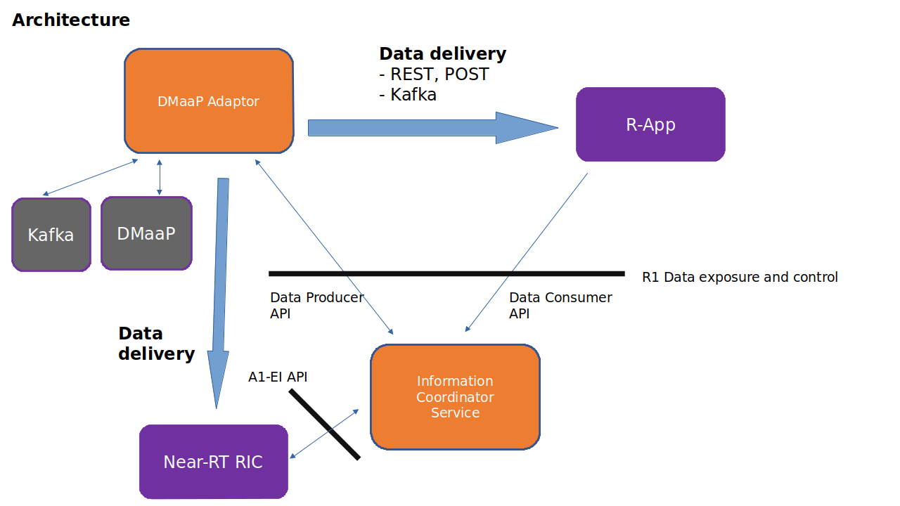
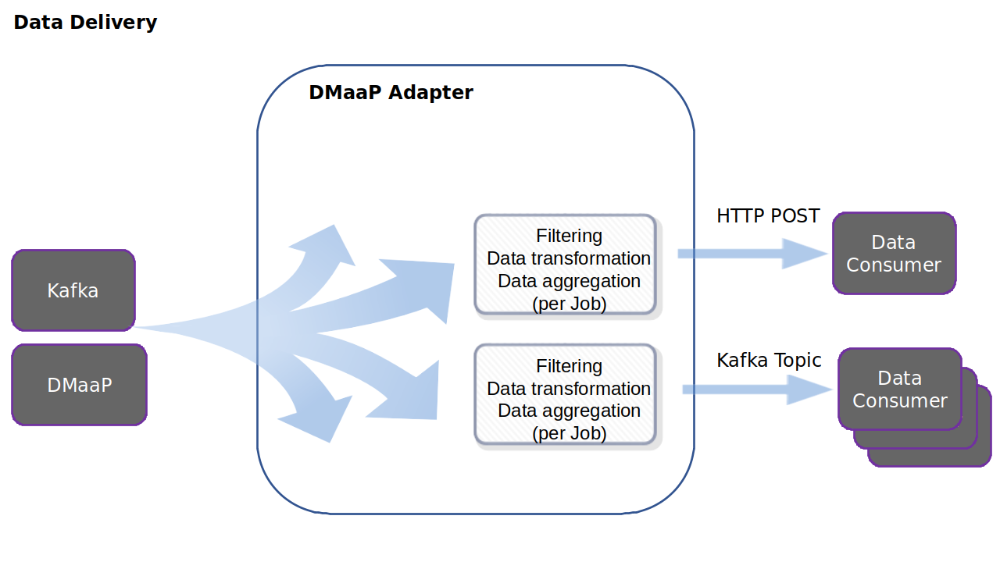
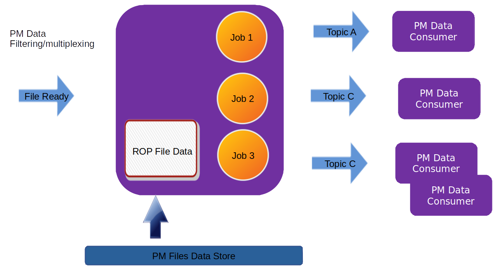

.. This work is licensed under a Creative Commons Attribution 4.0 International License.
.. SPDX-License-Identifier: CC-BY-4.0
.. Copyright (C) 2022 Nordix

DMaaP Adapter
~~~~~~~~~~~~~

************
Introduction
************

This is a generic information producer using the Information Coordination Service (ICS) Data Producer API. It can get information from DMaaP (ONAP) or directly from Kafka topics.
The information can be filtered, transformed, aggregated and then delivered to data consumers using REST calls (POST) or via Kafka.

The DMaaP Adapter registers itself as an information producer along with its information types in Information Coordination Service (ICS).
The information types are defined in a configuration file.

A data consumer can create an information job (data subscription) using the ICS consumer API (for R-Apps) or the A1-EI (Enrichment Information) API (for NearRT-RICs) based on the registered information types.
This service will get data from DMaaP MR or Kafka topics and deliver it to the data consumers based on their created subscription jobs.

So, a data consumer may be decoupled from DMaaP and/or Kafka this way.

The service is implemented in Java Spring Boot (DMaaP Adapter Service).

This product is a part of :doc:`NONRTRIC <nonrtric:index>`.

*************
Data Delivery
*************
When a data consumer creates an Information Job, either a URL for REST callbacks, or a Kafka Topic can be given as output for the job.
After filtering, aggregation and data transformation the data will be delivered to the output. Several data consumers can receive data from one Kafka Topic.

The output will be the same regardless if the information is received from DMaaP of from Kafka. If the data is not buffered/aggregated,
and the output is a Kafka Stream, both the keys and the values are forwarded (after filtering/transformation).
If the output is HTTP, only the the values are forwarded (in the HTTP body).

****************
Data Aggregation
****************
When an Information Job is created, a bufferTimeout can be defined for aggregation of information.
If this feature is used, the subscribed data will be buffered and will be delivered in chunks.

The data will then be wrapped in a JSON array in a manner similar to DMaaP. The type configuration can define if the received data is Json.
If not, each object is quoted (the output will then be an array of strings). If the data type is Json, the output will be an array of Json objects.

******************
Configuration File
******************

The configuration file defines which DMaaP and Kafka topics that should be listened to and registered as subscribeable information types.
There is an example configuration file in config/application_configuration.json

Each entry will be registered as a subscribe information type in ICS. The following attributes can be used in each entry:

* id, the information type identifier.

* dmaapTopicUrl, a URL to use to retrieve information from DMaaP. Defaults to not listen to any topic.

* kafkaInputTopic, a Kafka topic to listen to. Defaults to not listen to any topic.

* useHttpProxy, indicates if a HTTP proxy shall be used for data delivery (if configured). Defaults to false.
  This parameter is only relevant if a HTTPproxy is configured in the application.yaml file.

* dataType, this can be set to "pmData" which gives a possibility to perform a special filtering of PM data.

* isJson, this indicates that the received is Json objects (from Kafka a stream of objects and from DMaaP an array of quoted json objects).
  Default value is false.
  If the received data is Json objects, the data sent to the consumer does not need to be quoted.
  When buffering is used the output will be an array of json objects '[{},{}]' as opposed to an array of strings '["string1", "string2"]'.
  When buffering is not used, the output content-type will be 'application/json' as opposed to 'text/plain'. When buffering is used, the
  output content-type will 'application/json' regardless of this parameter.

These parameters will be used to choose which parameter schemas that defines which parameters that can be used when creating an information job/data subscription.

Below follows an example of a configuration file.

.. code-block:: javascript

    {
       "types": [
          {
             "id": "DmaapInformationType",
             "dmaapTopicUrl": "/dmaap-topic-1",
             "useHttpProxy": true,
             "isJson" : true
          },
          {
             "id": "KafkaInformationType",
             "kafkaInputTopic": "TutorialTopic",
          },
          {
             "id": "PmInformationType",
             "dmaapTopicUrl": "/dmaap-topic-2",
             "dataType": "PmData",
             "isJson" : true
          }
       ]
    }

**************************
Information Job Parameters
**************************

When an information consumer creates an information job,it can provide type specific parameters. The allowed parameters are defined by a Json Schema.
The following schemas can be used by the component (are located in dmaapadapter/src/main/resources):

===============
typeSchema.json
===============
This schema will by default be registerred for the type. The following properties are defined:

* kafkaOutputTopic, optional parameter which enables the information job to output data to a Kafka topic instead of a direct call to a data consumer. The output of a job can be directed to HTTP or to Kafka regardless if the input is retrieved from DMaaP or from Kafka.

* filterType, selects the type of filtering that will be done. This can be one of: "regexp", "json-path", "jslt".

  * regexp is for standard regexp matching of text. Objects that contains a match of the expression will be pushed to the consumer.
  * json-path can be used for extracting relevant data from json.
  * jslt, which is an open source language for JSON processing. It can be used both for selecting matching json objects and for extracting or even transforming of json data. This is very powerful.

* filter, the value of the filter expression.
* bufferTimeout can be used to buffer several json objects received from Kafka when kafkaInputTopic is defined into one json array. If bufferTimeout is used, the delivered data will be a Json array of the objects received. If not, each received object will be delivered in a separate call. This contains:

  * maxSize, the maximum number of objects to collect before delivery to the consumer
  * maxTimeMiliseconds, the maximum time to delay delivery (to buffer).

* maxConcurrency, defines max how many paralell REST calls the consumer wishes to receive. 1, which is default, means sequential. A higher value may increase throughput.

Below follows examples of some filters.

.. code-block:: javascript

    {
      "filterType":"regexp",
      "filter": ".*"
    }

.. code-block:: javascript

    {
      "filterType":"jslt",
      "filter": "if(.event.commonEventHeader.sourceName == \"O-DU-1122\") .event.perf3gppFields.measDataCollection.measInfoList[0].measValuesList[0].measResults[0].sValue"
    }

.. code-block:: javascript

    {
      "filterType":"json-path",
      "filter": "$.event.perf3gppFields.measDataCollection.measInfoList[0].measTypes.sMeasTypesList[0]"
    }

Below follows an example of using bufferTimeout and maxConcurrency.

.. code-block:: javascript

    {
       "bufferTimeout":{
          "maxSize":123,
          "maxTimeMiliseconds":456
       },
       "maxConcurrency":1
    }

=====================
typeSchemaPmData.json
=====================
This schema will be registered when the configured dataType is "pmData".
This will extend the filtering capabilities so that a special filter for PM data can be used. Here it is possible to
define which meas-types (counters) to get from which resources.

"It is possible to both filter on new data that is collected from the traffical nodes and to query from data that is already collected.

The filterType parameter is extended to allow value "pmdata" which can be used for PM data filtering.

* sourceNames an array of source names for wanted PM reports.
* measObjInstIds an array of meas object instances for wanted PM reports. If a given filter value is contained in the filter definition, it will match (partial matching).
  For instance a value like "NRCellCU" will match "ManagedElement=seliitdus00487,GNBCUCPFunction=1,NRCellCU=32".
* measTypeSpecs selects the meas types to get. This consist of:

  * measObjClass matching of the class of the measObjInstId. The measObjInstId must follow the 3GPP naming conventions for Managed Objects (3GPP TS 32.106-8).
  * measTypes the name of the measurement types (connected to the measObjClass).
* measuredEntityDns partial match of meas entity DNs.
  Example, for a distinguished name "ManagedElement=RNC-Gbg-1,ENodeBFunction=1", the MO class will be "ENodeBFunction".
* pmRopStartTime gives a possibility to query from already collected PM files. The start file is the time from when the information shall be returned.
  In this case, the query is only done for files from the given "sourceNames".
  If this parameter is excluded, only "new" reports will be delivered as they are collected from the traffical nodes.

All PM filter properties are optional and a non given will result in "match all" (except the pmRopStartTime).

Below follows an example of a PM filter.

.. code-block:: javascript

    {
      "filterType":"pmdata",
      "filter": {
        "sourceNames":[
           "O-DU-1122"
        ],
        "measObjInstIds":[
           "UtranCell=dGbg-997"
        ],
        "measTypeSpecs":[
             {
                "measuredObjClass":"UtranCell",
                "measTypes":[
                   "succImmediateAssignProcs"
                ]
             }
          ],
        "measuredEntityDns":[
           "ManagedElement=RNC-Gbg-1"
        ],
        "pmRopStartTime" : "2022-12-13T10:50:44.000-08:00"
      }
    }

Here is an example of a filter that will
match two counters from all cells in two traffical nodes.

.. code-block:: javascript

    {
      "filterType":"pmdata",
      "filter": {
        "sourceNames":[
           "O-DU-1122", "O-DU-1123"
        ],
        "measTypeSpecs":[
             {
                "measuredObjClass":"NRCellCU",
                "measTypes":[
                   "pmCounterNumber0", "pmCounterNumber1"
                ]
             }
          ],

      }
    }

********************
Bulk PM subscription
********************

The sequence is that a "new file event" is received (from a Kafka topic).
The file is read from local storage (file storage or S3 object store). For each Job, the specified PM filter is applied to the data
and the result is sent to the Kafka topic specified by the Job (by the data consumer).

The result of the PM filtering is still following the structure of a 3GPP PM report.
Here follows an example of a resulting delivered PM report.

.. code-block:: javascript

   {
      "event":{
         "commonEventHeader":{
            "domain":"perf3gpp",
            "eventId":"9efa1210-f285-455f-9c6a-3a659b1f1882",
            "eventName":"perf3gpp_gnb-Ericsson_pmMeasResult",
            "sourceName":"O-DU-1122",
            "reportingEntityName":"",
            "startEpochMicrosec":951912000000,
            "lastEpochMicrosec":951912900000,
            "timeZoneOffset":"+00:00"
         },
         "perf3gppFields":{
            "perf3gppFieldsVersion":"1.0",
            "measDataCollection":{
               "granularityPeriod":900,
               "measuredEntityUserName":"RNC Telecomville",
               "measuredEntityDn":"SubNetwork=CountryNN,MeContext=MEC-Gbg-1,ManagedElement=RNC-Gbg-1",
               "measuredEntitySoftwareVersion":"",
               "measInfoList":[
                  {
                     "measInfoId":{
                        "sMeasInfoId":""
                     },
                     "measTypes":{
                        "map":{
                           "succImmediateAssignProcs":1
                        },
                        "sMeasTypesList":[
                           "succImmediateAssignProcs"
                        ]
                     },
                     "measValuesList":[
                        {
                           "measObjInstId":"RncFunction=RF-1,UtranCell=Gbg-997",
                           "suspectFlag":"false",
                           "measResults":[
                              {
                                 "p":1,
                                 "sValue":"1113"
                              }
                           ]
                        },
                        {
                           "measObjInstId":"RncFunction=RF-1,UtranCell=Gbg-998",
                           "suspectFlag":"false",
                           "measResults":[
                              {
                                 "p":1,
                                 "sValue":"234"
                              }
                           ]
                        },
                        {
                           "measObjInstId":"RncFunction=RF-1,UtranCell=Gbg-999",
                           "suspectFlag":"true",
                           "measResults":[
                              {
                                 "p":1,
                                 "sValue":"789"
                              }
                           ]
                        }
                     ]
                  }
               ]
            }
         }
      }
   }

If several jobs publish to the same Kafka topic (shared topic), the resulting filtered output will be an aggregate of all matching filters.
So, each consumer will then get more data than requested.

==================
Sent Kafka headers
==================

For each filtered result sent to a Kafka topic, there will the following proerties in the Kafa header:

* type-id, this propery is used to indicate the ID of the information type. The value is a string.
* gzip, if this property exists the object is gzipped (otherwise not). The property has no value.